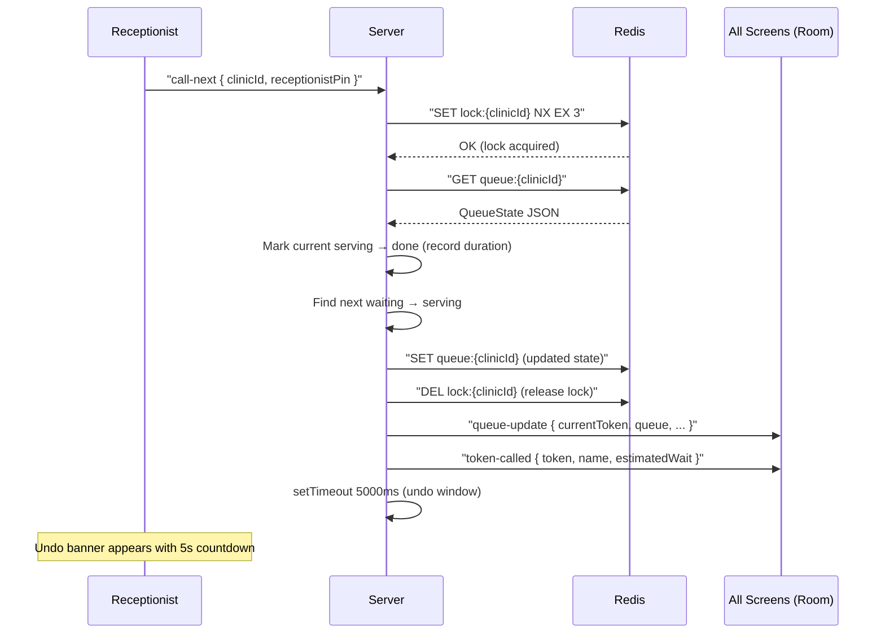
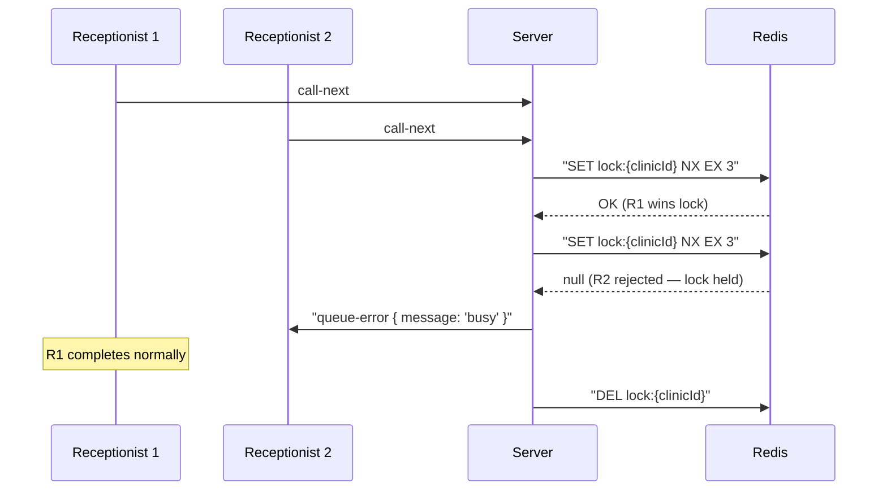
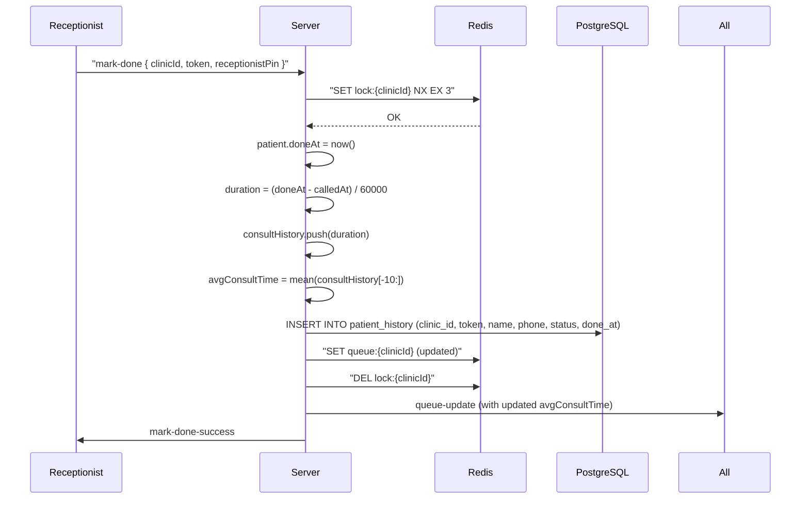
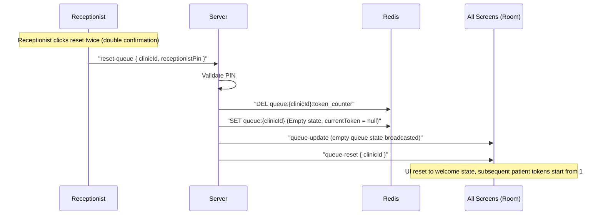

# QueueCure — Socket Event Diagram

This document describes all real-time events flowing between clients and the server in the QueueCure system.

---

## System Architecture

```
┌──────────────────┐        ┌──────────────────────┐        ┌──────────────┐
│  Receptionist    │        │   Socket.IO Server    │        │  Display TV  │
│  Dashboard       │◄──────►│   (Express + Redis)   │◄──────►│  /display    │
│  /receptionist   │        │                       │        │              │
└──────────────────┘        └──────────────────────┘        └──────────────┘
                                        ▲
                                        │
                            ┌──────────────────────┐
                            │   Patient Mobile     │
                            │   /patient?token=N   │
                            └──────────────────────┘
```

All three clients join the same **clinic room** via Socket.IO. Events are broadcast to the room, ensuring all screens stay in sync without polling.

---

## Client → Server Events

| Event | Payload | Auth | Description |
|-------|---------|------|-------------|
| `join-clinic` | `{ clinicId }` | None | Joins a Socket.IO room and receives `state-sync` |
| `add-patient` | `{ clinicId, name, phone?, priority? }` | None | Adds a patient; priority ones are sorted to the front |
| `call-next` | `{ clinicId, receptionistPin }` | PIN | Atomically advances the queue using a Redis mutex |
| `mark-done` | `{ clinicId, token, receptionistPin }` | PIN | Marks serving patient as done; records real duration in `consultHistory` & PostgreSQL |
| `skip-token` | `{ clinicId, token, receptionistPin }` | PIN | Marks a waiting patient as skipped & logs to PostgreSQL |
| `undo-call` | `{ clinicId, receptionistPin }` | PIN | Reverts the last call (within 5-second window only) |
| `recall-token` | `{ clinicId, receptionistPin }` | PIN | Re-announces current serving token without advancing queue |
| `pause-queue` | `{ clinicId, pause: boolean, receptionistPin }` | PIN | Pauses or resumes queue; blocks `call-next` while paused |
| `reset-queue` | `{ clinicId, receptionistPin }` | PIN | Danger Zone command: deletes token counter, clears queue lists, resets token sequence to 1 |
| `set-avg-time` | `{ clinicId, minutes, receptionistPin }` | PIN | Sets the fallback average consultation time |

---

## Server → Client Events

| Event | Emitted To | Payload | Description |
|-------|-----------|---------|-------------|
| `state-sync` | Joining socket only | Full `QueueState` | Sent on `join-clinic` and after reconnect |
| `queue-update` | Entire clinic room | `{ currentToken, queue, avgWait, isPaused, consultHistory, avgConsultTime, lastUpdated }` | Fired after every state mutation |
| `token-called` | Entire clinic room | `{ token, name, estimatedWait, isRecall? }` | Triggers chime on TV; triggers undo banner on receptionist |
| `queue-paused` | Entire clinic room | `{ isPaused: boolean }` | Dedicated event for pause state so display can show overlay immediately |
| `queue-reset` | Entire clinic room | `{ clinicId }` | Fired when queue is wiped & reset |
| `patient-added` | Emitting socket only | Full `Patient` object | Triggers QR code modal on receptionist screen |
| `mark-done-success` | Emitting socket only | `{ token }` | Confirms successful mark-done operation |
| `recall-success` | Emitting socket only | `{ token, name }` | Confirms recall was sent |
| `queue-error` | Emitting socket only | `{ message: string }` | Validation errors, empty queue, expired undo, wrong PIN |

---

## Key Flows (Sequence Diagrams)

### 1. Call Next (Happy Path with Undo Window)



### 2. Race Condition: Concurrent Call Next



### 3. Mark Done (PostgreSQL Persist & Real Duration Recording)



### 4. Reset Queue & Tokens (Danger Zone)



---

## Data Shapes

### Patient
```typescript
interface Patient {
  token: number;          // Auto-incremented per clinic
  name: string;
  phone?: string;
  clinicId: string;
  priority?: boolean;     // Sorts to front of waiting queue
  status: 'waiting' | 'serving' | 'done' | 'skipped';
  addedAt: number;        // Unix ms timestamp
  calledAt?: number;      // Set when status → serving
  doneAt?: number;        // Set when status → done (by mark-done or next call-next)
}
```

### QueueState (Redis key: `queue:{clinicId}`)
```typescript
interface QueueState {
  clinicId: string;
  currentToken: number | null;
  queue: Patient[];
  consultHistory: number[];   // Last 10 real consultation durations (minutes)
  avgConsultTime: number;     // Rolling mean of consultHistory; fallback to receptionist-set value
  isPaused: boolean;
  lastDate?: string;          // Calendar date YYYY-MM-DD
}
```

---

## Redis Keys

| Key | Type | Purpose |
|-----|------|---------|
| `queue:{clinicId}` | String (JSON) | Full serialized QueueState |
| `queue:{clinicId}:token_counter` | Integer | Auto-incrementing token number |
| `lock:{clinicId}` | String (NX, EX 3) | Atomic mutex for call-next / mark-done |
